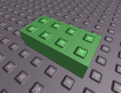

# Summary

The **BasePart** is a structural class that represents a physical object. When
it is in the [Workspace](Workspace.html), it will move and interact with other
BaseParts.

# Details

BaseParts are the basic building blocks of any Roblox place. Commonly known as
"bricks", you'll see these the most often of any other instance, as almost
every place is built out of these. It is possible to stretch a BasePart to
very large sizes and use them for baseplates, or make them very small and use
them to create cool looking [Tools](Tool.html).

A BasePart instance can be edited using the various studio tools. It is
available via either the insert menu, or the Object Insert menu. It can also
be created using the 'Instance.new()' function.

Using [Mesh](DataModelMesh.html) objects, such as
[SpecialMesh](SpecialMesh.html), [BlockMesh](BlockMesh.html), or
[CylinderMesh](CylinderMesh.html), you can change the shape of BaseParts.
Using [Decal](Decal.html) objects, you can place pictures on the surfaces of
BaseParts. [Sparkles](Sparkles.html), [Smoke](Smoke.html), and
[Fire](Fire.html) will provide particle effects when parented under a
BasePart. Using [JointInstances](JointInstance.html), a BasePart can have
bonds formed with another BasePart, so that the two stay in the same relative
position.

There are many scripting opportunities using the BasePart. Many of the other
scripting objects, such as [BodyMovers](BodyMover.html), operate inside of a
BasePart. Editing the BasePart's properties through a script can result in a
lot of fun opportunities.
